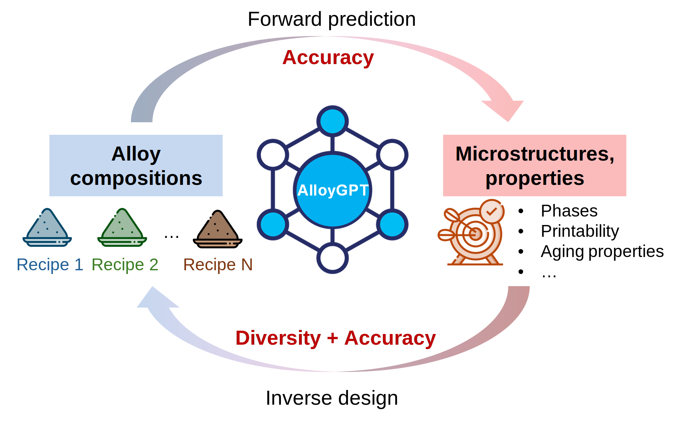

# AlloyGPT: End-to-end prediction and design of additively manufacturable alloys using an autoregressive language model

Bo Ni<sup>1</sup>, Benjamin Glaser<sup>1</sup>, S. Mohadeseh Taheri-Mousavi<sup>1,2,3</sup>

<sup>1</sup> Department of Materials Science and Engineering, Carnegie Mellon University

<sup>2</sup> Department of Mechanical Engineering, Carnegie Mellon University

<sup>3</sup> Lead contact: smtaherimousavi@cmu.edu

Rapid progress in additive manufacturing of alloys opens opportunities in controlling compositions and microstructures at voxel-size resolution in complex geometries, thus unlocking unprecedented design and performance in various critical engineering applications. However, to fully exploit such potential, capable yet efficient models for navigating the vast design spaces of alloy compositions, structures and properties are of great research interest. Here, we present AlloyGPT, an autoregressive alloy-specific language model, that learns the composition-structure-property relationship and generates novel designs for additively manufacturable alloys. Specifically, we develop efficient grammar to convert physics-rich alloy datasets into readable text records for both forward prediction and inverse design tasks. Then, we construct a customized tokenizer and generative pre-trained transformer (GPT) model to master this alloy-specific language through autoregressive training. At deployment, our model can accurately predict multiple phase structures and properties based on given alloy compositions, achieving R2 values ranging from 0.86 to 0.99 for the test set. When tested beyond the learned composition domain, this performance only degrades gradually in a stable manner. Given the desired properties and structures, the same model can suggest multiple alloy compositions that meet the design goals. And the balance between composition diversity and design accuracy can be further tuned stably. Our AlloyGPT model presents a novel way of integrating comprehensive knowledge of alloys in terms of language and can simultaneously solve forward prediction and inverse design tasks with accuracy, diversity and robustness. This fundamental language model will open new avenues to accelerate knowledge integration and material design for pure or gradient structural alloys manufactured by traditional and additive manufacturing. 



## Installation

Create a virtual environment

```bash
conda env create --prefix=./AlloyGPT_env --file=AlloyGPT_env_environment.yml
conda activate ./AlloyGPT_env

```

Install:
```bash
pip install git+https://github.com/Taheri-Mousavi-Laboratory/AlloyGPT.git

```
If you want to create an editable installation, clone the repository using `git`:
```bash
git clone https://github.com/Taheri-Mousavi-Laboratory/AlloyGPT.git
cd AlloyGPT
```
Then, install:
```bash
pip install -r requirements.txt
pip install -e .
```
### Directory structure
```
ModeShapeDiffusionDesign/
│
├── VibeGen/                                    # Source code directory
│   ├── DataPack.py
│   ├── ModelPack.py
│   ├── TrainPack.py
│   ├── UtilityPack.py
│   └── TestPack.py
│
├── 0_AlloyGPT_Inferring_demo.ipynb             # demo 1: for making inferences
├── 1_AlloyGPT_training_demo.ipynb              # demo 2: for training
│
├── setup.py                                    # The setup file for packaging
├── requirements.txt                            # List of dependencies
├── README.md                                   # Documentation
├── assets/                                     # Support materials
└── ...
```

## Usage

### Inference notebook

In the following example, we will demonstrate how to solve the forward prediction and inverse design tasks with the same trained AlloyGPT model. Note that, you will need the password to access the trained model due to restrictions of [Thermo-Calc EULA](https://thermocalc.com/wp-content/uploads/Documentation/Terms_Conditions/eula.pdf).

```
0_AlloyGPT_Inferring_demo.ipynb
```

### Training notebook

In the following example, we will demonstrate how to train the AlloyGPT model. Note that, you will need the password to access the dataset due to restrictions of [Thermo-Calc EULA](https://thermocalc.com/wp-content/uploads/Documentation/Terms_Conditions/eula.pdf).

```
1_AlloyGPT_training_demo.ipynb 
```

### Pretrained models
Due to the restrictions of [Thermo-Calc EULA](https://thermocalc.com/wp-content/uploads/Documentation/Terms_Conditions/eula.pdf), the trained model will only be made available based on reasonable request. User tokens will be asked for to access the trained model when running the notebooks listed above.

### Reference

```bibtex
@paper{BoBenjaminSMohadeseh2025AlloyGPT,
      title={ AlloyGPT: End-to-end prediction and design of additively manufacturable alloys using an autoregressive language model}, 
      author={Bo Ni, Benjamin Glaser and S. Mohadeseh Taheri-Mousavi},
      year={2025},
      eprint={xxxx.xxxxx},
      archivePrefix={arXiv},
      url={https://arxiv.org/abs/xxxx.xxxxx}, 
}
```

Our implementation is inspired by the [nanoGPT](https://github.com/karpathy/nanoGPT) repository by [Andrej Karpathy](https://github.com/karpathy).